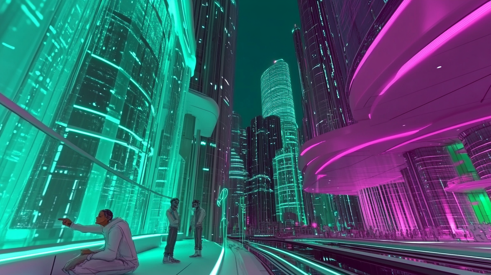
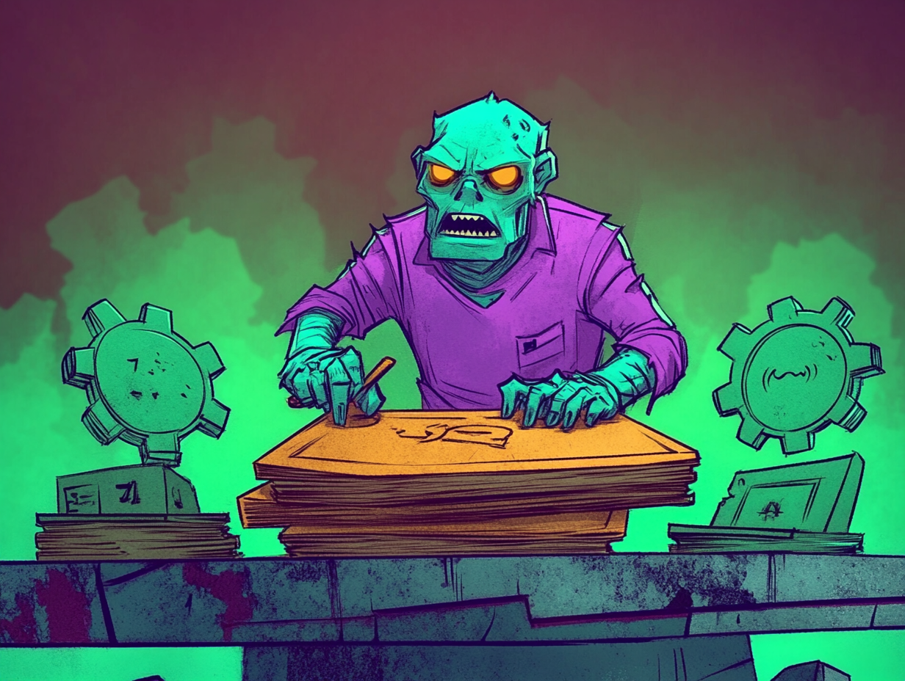

# Welcome to **L!ft Off**

_Your Website, Your Way—We Handle the Hard Part_

---

## **What is L!ft Off?**

**L!ft Off** is a rapid, AI-enhanced website creation service designed to launch stunning, professional websites in **72 hours or less**. Perfect for entrepreneurs, small businesses, and non-profits looking to establish or refresh their online presence.

---

---

## **Why Choose L!ft Off?**

### **Unmatched Speed**

Launch your fully functional, visually appealing website in just 72 hours.

### **Tailored Customization**

From personalized themes to SEO-optimized designs, we ensure your website reflects your brand.

### **Affordable Solutions**

With packages starting at $500, L!ft Off delivers unparalleled value compared to traditional agencies.

---

## **How It Works**

### 1. Share Your Vision

Provide us with your goals, branding details, and any unique requirements.

### 2. Harness the Power of AI

Our advanced tools generate visually stunning designs and compelling content tailored to your needs.

### 3. Launch in 72 Hours

Receive a ready-to-use, professional website—delivered lightning fast.

---

## **Our Services**

### **Core Design Packages**

Select from 3, 8, or 12-page options to match your needs and budget.

### **Add-On Features**

Enhance your website with optional e-commerce functionality, custom interactive elements, or analytics setup.

### **Personal Consultation**

Our premium packages include a 15-minute consultation to align with your goals and vision.

---

## **Portfolio Spotlight**

Check out some of the stunning websites we've launched:

- [Jacob's House](https://dev3l.github.io/jacobs-house/)
- [Ephraim Designs](https://dev3l.github.io/ephraim-designs/)

---

## **Ready to Take the Next Step?**

At **L!ft Off**, every moment counts. Transform your vision into a reality in just 72 hours. We're ready when you are.

[Visit Our Contact Page](contact.md) to take the next step.

> L!ft Off isn’t just a service—it’s the start of your digital transformation.
